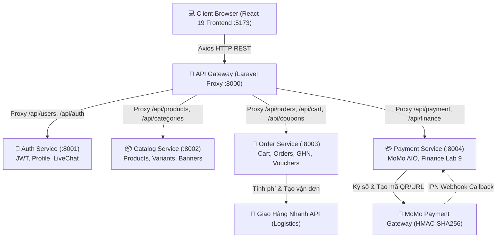
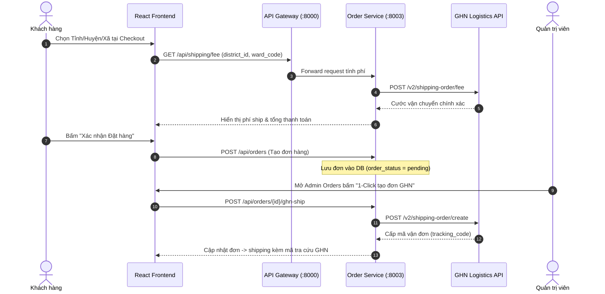
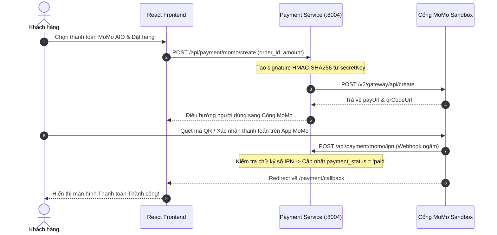
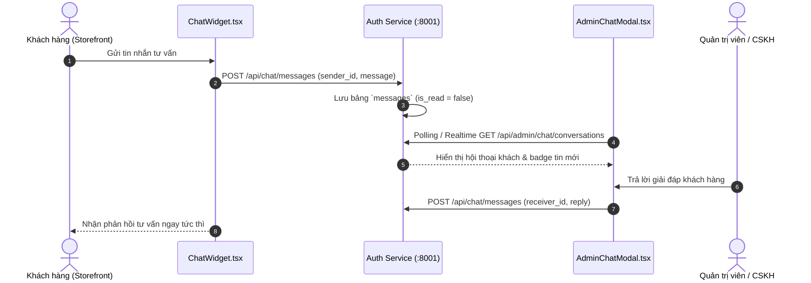

# ⚽ ĐỒ ÁN: HỆ THỐNG THƯƠNG MẠI ĐIỆN TỬ THỂ THAO STRIKER
> **Môn học:** Phát triển Phần mềm Hướng Dịch vụ (SOA) / Kiến trúc Microservices  
> **Nhóm thực hiện:** Nhóm 8  
> **Quy mô:** 5 Thành viên — Đóng góp đồng đều **20% / người** (~1.600 – 1.850 Lines of Code)

---

## 🏗️ 1. SƠ ĐỒ KIẾN TRÚC HỆ THỐNG MICROSERVICES (SYSTEM ARCHITECTURE)

Hệ thống được thiết kế theo mô hình **Decoupled Microservices** phân tán. Toàn bộ giao tiếp giữa Single Page App (Frontend) và các dịch vụ nội bộ (Services) đều được quản lý, bảo mật và điều hướng tập trung qua **API Gateway**.

```
                           ┌─────────────────────────────────────────┐
                           │   crs-frontend (React 19 + TypeScript)  │
                           │              Port: 5173                 │
                           └────────────────────┬────────────────────┘
                                                │ REST API (Bearer JWT / Axios)
                                                ▼
                           ┌─────────────────────────────────────────┐
                           │       api-gateway (Laravel Core)        │
                           │              Port: 8000                 │
                           │   (Reverse Proxy, Rate Limit, Auth Guard)│
                           └───────┬─────┬─────────┬─────────┬───────┘
                                   │     │         │         │
          ┌────────────────────────┘     │         │         └────────────────────────┐
          │                              │         │                                  │
          ▼                              ▼         ▼                                  ▼
┌──────────────────┐  ┌────────────────────┐  ┌──────────────────┐  ┌──────────────────┐  ┌──────────────────┐
│   auth-service   │  │  catalog-service   │  │  order-service   │  │ payment-service  │  │  External APIs   │
│    Port: 8001    │  │     Port: 8002     │  │    Port: 8003    │  │    Port: 8004    │  │  GHN / MoMo IPN  │
├──────────────────┤  ├────────────────────┤  ├──────────────────┤  ├──────────────────┤  ├──────────────────┤
│ • Users & Admin  │  │ • Categories       │  │ • Orders & Items │  │ • MoMo Payment   │  │ • GHN Shipping   │
│ • User Addresses │  │ • Brands           │  │ • Cart & Items   │  │ • Transactions   │  │   Fee & Tracking │
│ • Live Messages  │  │ • Products & Tags  │  │ • Coupons/Voucher│  │ • Payment Logs   │  │ • MoMo Sandbox   │
│ • JWT / Password │  │ • Variants/Banners │  │ • Product Reviews│  │ • IPN Webhooks   │  │   AIO QR & ATM    │
│ • DB: auth_db    │  │ • DB: catalog_db   │  │ • DB: order_db   │  │ • DB: payment_db │  │                  │
└──────────────────┘  └────────────────────┘  └──────────────────┘  └──────────────────┘  └──────────────────┘
```



---

## 🔄 2. SƠ ĐỒ QUY TRÌNH & LUỒNG DỮ LIỆU CÁC CHUYÊN ĐỀ NÂNG CAO

### 2.1. Quy trình Đặt hàng & Tạo Vận đơn Giao Hàng Nhanh (GHN Logistics)


---

### 2.2. Quy trình Thanh toán MoMo Sandbox (HMAC-SHA256 & Webhook IPN)


---

### 2.3. State Machine Quản lý Giao dịch & Tài chính Finance (Lab 9)
```
   ┌─────────────┐
   │   pending   ├──────────────┐
   └──────┬──────┘              │ (Giao dịch thất bại)
          │ (Thu tiền/MoMo)     ▼
          ▼              ┌─────────────┐
   ┌─────────────┐       │   failed    │
   │    paid     │       └─────────────┘
   └──────┬──────┘
          │ (Yêu cầu trả hàng)
          ▼
   ┌─────────────────┐
   │ refund_pending  │
   └──────┬──────────┘
          │ (Admin duyệt hoàn tiền)
          ▼
   ┌─────────────────┐
   │    refunded     │
   └─────────────────┘
```
> **Nguyên tắc Tài chính cốt lõi (Finance Rule):** Doanh thu thực tế (`totalRevenue`) và Chi tiêu của khách hàng (`totalSpent`) chỉ được ghi nhận từ các đơn hàng có trạng thái `order_status IN ('delivered', 'paid')` hoặc `payment_status = 'paid'`. Không tính khống các đơn đang chờ xử lý (`pending`), đang giao (`shipping`) hoặc đã hủy (`cancelled`).

---

### 2.4. Luồng Tin nhắn Tư vấn trực tuyến LiveChat (Lab 7)


---

## 🗄️ 3. ĐẶC TẢ CƠ SỞ DỮ LIỆU CÁC DỊCH VỤ

```
┌──────────────────────────────────────┐       ┌──────────────────────────────────────┐
│        striker_auth_db (:8001)       │       │       striker_catalog_db (:8002)     │
├──────────────────────────────────────┤       ├──────────────────────────────────────┤
│ • users (id, name, email, role...)   │       │ • categories (id, name, slug, icon)  │
│ • addresses (province, district, ward│       │ • brands (id, name, slug, logo)      │
│ • messages (sender_id, message, read)│       │ • products (id, sku, price, tags...) │
└──────────────────────────────────────┘       │ • product_variants (color, size, sku)│
                                               │ • banners (id, title, image, link)   │
                                               └──────────────────────────────────────┘
┌──────────────────────────────────────┐       ┌──────────────────────────────────────┐
│        striker_order_db (:8003)      │       │       striker_payment_db (:8004)     │
├──────────────────────────────────────┤       ├──────────────────────────────────────┤
│ • orders (id, code, totals, status)  │       │ • payments (id, order_id, amount...) │
│ • order_items (product, price, qty)  │       │ • payment_transactions (Lab 9)       │
│ • carts & cart_items                 │       │ • payment_logs (raw_payload, status) │
│ • coupons & coupon_usages            │       └──────────────────────────────────────┘
│ • reviews (rating, comment)          │
└──────────────────────────────────────┘
```

---

## 👥 4. BẢNG PHÂN CHIA NHIỆM VỤ CHI TIẾT (5 THÀNH VIÊN - 20%/NGƯỜI)

| STT | Thành viên & Vai trò | Backend Service (100% File sở hữu) | Frontend Files & Pages (100% File sở hữu) | LoC ước tính | Tỷ trọng |
| :---: | :--- | :--- | :--- | :---: | :---: |
| **01** | **Thành viên 1**<br>*(Kiến trúc & Gateway)* | • `api-gateway/app/Http/Controllers/GatewayController.php`<br>• `api-gateway/routes/api.php`, `config/cors.php`<br>• Script điều phối toàn hệ thống `start-all.ps1` | • `src/App.tsx`, `src/main.tsx`, `src/types.ts`<br>• `src/context/AppContext.tsx` (State toàn cục)<br>• `src/services/api.js`, `api.d.ts` (Axios Interceptors)<br>• `src/layouts/ShopLayout.tsx`, `AdminLayout.tsx`<br>• `src/components/Header.tsx`, `Footer.tsx`<br>• `src/components/ScrollToTop.tsx`, `Skeleton.tsx` | **~1.600 lines** | **20%** |
| **02** | **Thành viên 2**<br>*(Auth & CSKH - Lab 7)* | • `auth-service/app/Http/Controllers/AuthController.php`<br>• `AddressController.php` (Sổ địa chỉ GHN 3 cấp)<br>• `Admin/ChatController.php` (LiveChat CSKH - Lab 7)<br>• `Models/User.php`, `Address.php`, `Message.php`<br>• `database/migrations/*` & Seeders (`auth_db`) | • `src/pages/shop/LoginPage.tsx`, `RegisterPage.tsx`<br>• `src/pages/shop/ForgotPassword.tsx`, `VerifyEmail.tsx`<br>• `src/pages/shop/Profile.tsx` (Hồ sơ người dùng)<br>• `src/components/AddressBookModal.tsx`<br>• `src/components/ChatWidget.tsx` (Widget chat khách)<br>• `src/components/admin/AdminChatModal.tsx` (Bàn trực Admin)<br>• `src/pages/admin/Customers.tsx` (Khóa/Mở tài khoản)<br>• `src/services/auth.ts`, `src/services/chat.ts` | **~1.750 lines** | **20%** |
| **03** | **Thành viên 3**<br>*(Catalog & Sản phẩm)* | • `catalog-service/app/Http/Controllers/ProductController.php`<br>• `CategoryController.php`, `BrandController.php`<br>• `BannerController.php`<br>• `Models/Product.php`, `ProductVariant.php`<br>• `Category.php`, `Brand.php`, `Banner.php`<br>• `database/migrations/*` & Seeders (`catalog_db`) | • `src/pages/shop/Home.tsx` & `HeroBanner.tsx`<br>• `src/pages/shop/Shop.tsx` (Bộ lọc đa năng & Search)<br>• `src/components/ProductCard.tsx`<br>• `src/pages/shop/ProductDetail.tsx` (Chọn Màu/Size)<br>• `src/pages/admin/Products.tsx` (Quản trị sản phẩm & SKU)<br>• `src/pages/admin/Settings.tsx` (Quản trị Banner, Danh mục)<br>• `src/services/catalog.ts`, `src/services/banners.ts` | **~1.800 lines** | **20%** |
| **04** | **Thành viên 4**<br>*(Order & GHN Logistics)* | • `order-service/app/Http/Controllers/CartController.php`<br>• `OrderController.php` (Vòng đời đơn 6 trạng thái)<br>• `ShippingController.php` & `Services/GhnService.php`<br>• `CouponController.php`, `ReviewController.php`<br>• `Models/Order.php`, `OrderItem.php`, `CartItem.php`<br>• `Cart.php`, `Coupon.php`, `Review.php`<br>• `database/migrations/*` & Seeders (`order_db`) | • `src/components/CartDrawer.tsx` (Giỏ hàng trượt Drawer)<br>• `src/components/CheckoutAddressCard.tsx`<br>• `src/components/CouponModal.tsx`<br>• `src/pages/shop/Orders.tsx` (Lịch sử đơn & Tra cứu GHN)<br>• `src/components/ReviewModal.tsx` (Đánh giá sao)<br>• `src/pages/admin/Orders.tsx` (Xử lý đơn & 1-click GHN)<br>• `src/pages/admin/Vouchers.tsx` (Quản trị mã giảm giá)<br>• `src/services/orders.ts`, `shipping.ts`, `coupons.ts`, `reviews.ts` | **~1.850 lines** | **20%** |
| **05** | **Thành viên 5**<br>*(Payment & Tài chính - Lab 9)* | • `payment-service/app/Http/Controllers/MoMoPaymentController.php`<br>• `DashboardController.php` (Thống kê đơn hoàn tất/Doanh thu)<br>• `PaymentLogController.php` / Finance API<br>• `Models/Payment.php`, `PaymentLog.php`, `Transaction.php`<br>• `database/migrations/*` & Seeders (`payment_db`) | • `src/pages/shop/Checkout.tsx` (Cổng COD & MoMo)<br>• `src/pages/shop/PaymentCallback.tsx`<br>• `src/pages/admin/Dashboard.tsx` (Neon Spline Chart, 4 KPI, Top bán chạy)<br>• `src/pages/admin/Finance.tsx` (**Lab 9:** Báo cáo Tài chính, Đối soát MoMo/COD, Hoàn tiền)<br>• `src/services/payment.ts` | **~1.850 lines** | **20%** |

---

## 🌿 5. CHI TIẾT FILE VÀ NHÁNH GIT PHỤ TRÁCH TỪNG THÀNH VIÊN

### 👤 Thành viên 1: Kiến trúc Hệ thống, API Gateway & Core Frontend
* **Nhánh Git:** `feature/gateway-core-architecture`
* **Nhiệm vụ:** Thiết kế Reverse Proxy, bảo mật CORS, AppContext toàn cục, Axios Interceptor Bearer Token, ErrorBoundary và script `start-all.ps1`.
* **Mã nguồn:**
  - `api-gateway/app/Http/Controllers/GatewayController.php`, `routes/api.php`, `config/cors.php`, `bootstrap/app.php`
  - `crs-frontend/src/App.tsx`, `src/main.tsx`, `src/types.ts`, `src/context/AppContext.tsx`, `src/services/api.js`
  - `crs-frontend/src/layouts/*`, `src/components/Header.tsx`, `Footer.tsx`, `ScrollToTop.tsx`, `Skeleton.tsx`

---

### 👤 Thành viên 2: Xác thực JWT, Quản lý Khách hàng & LiveChat CSKH (Lab 7)
* **Nhánh Git:** `feature/auth-service-livechat`
* **Nhiệm vụ:** Đăng nhập/Đăng ký JWT, Sổ địa chỉ GHN 3 cấp, Module LiveChat CSKH 2 chiều thời gian thực, Khóa/Mở tài khoản khách hàng.
* **Mã nguồn:**
  - `auth-service/app/Http/Controllers/AuthController.php`, `AddressController.php`, `Admin/ChatController.php`
  - `auth-service/app/Models/User.php`, `Address.php`, `Message.php`, `database/migrations/*`
  - `crs-frontend/src/pages/shop/LoginPage.tsx`, `RegisterPage.tsx`, `ForgotPassword.tsx`, `Profile.tsx`
  - `crs-frontend/src/components/AddressBookModal.tsx`, `ChatWidget.tsx`, `admin/AdminChatModal.tsx`, `src/pages/admin/Customers.tsx`

---

### 👤 Thành viên 3: Quản lý Catalog, Sản phẩm & Trải nghiệm Cửa hàng
* **Nhánh Git:** `feature/catalog-products-shop`
* **Nhiệm vụ:** CRUD Sản phẩm, Biến thể SKU Màu/Size, Kho hàng, Banner trang chủ động, Bộ lọc đa tiêu chí tại Shop.
* **Mã nguồn:**
  - `catalog-service/app/Http/Controllers/ProductController.php`, `CategoryController.php`, `BrandController.php`, `BannerController.php`
  - `catalog-service/app/Models/Product.php`, `ProductVariant.php`, `Category.php`, `Brand.php`, `Banner.php`, `database/migrations/*`
  - `crs-frontend/src/pages/shop/Home.tsx`, `Shop.tsx`, `ProductDetail.tsx`, `src/components/HeroBanner.tsx`, `ProductCard.tsx`
  - `crs-frontend/src/pages/admin/Products.tsx`, `Settings.tsx`, `src/services/catalog.ts`, `banners.ts`

---

### 👤 Thành viên 4: Xử lý Đơn hàng, Logistics GHN, Khuyến mãi & Đánh giá
* **Nhánh Git:** `feature/order-service-ghn-logistics`
* **Nhiệm vụ:** Vòng đời đơn hàng 6 trạng thái, Tích hợp Giao Hàng Nhanh tính cước & tạo vận đơn 1-Click, Mã giảm giá Vouchers, Đánh giá sao.
* **Mã nguồn:**
  - `order-service/app/Http/Controllers/CartController.php`, `OrderController.php`, `ShippingController.php`, `CouponController.php`, `ReviewController.php`
  - `order-service/app/Services/GhnService.php`, `app/Models/Order.php`, `OrderItem.php`, `CartItem.php`, `Coupon.php`, `Review.php`
  - `crs-frontend/src/components/CartDrawer.tsx`, `CheckoutAddressCard.tsx`, `CouponModal.tsx`, `ReviewModal.tsx`
  - `crs-frontend/src/pages/shop/Orders.tsx`, `src/pages/admin/Orders.tsx`, `src/pages/admin/Vouchers.tsx`

---

### 👤 Thành viên 5: Cổng Thanh toán MoMo/COD, Dashboard & Báo cáo Tài chính (Lab 9)
* **Nhánh Git:** `feature/payment-momo-dashboard-finance`
* **Nhiệm vụ:** Tích hợp MoMo Sandbox (QR/URL HMAC-SHA256, Webhook IPN), Bảng điều khiển KPI/Spline Chart, Quản trị Báo cáo Tài chính & Đối soát giao dịch (`Finance.tsx`).
* **Mã nguồn:**
  - `payment-service/app/Http/Controllers/MoMoPaymentController.php`, `DashboardController.php`, `PaymentLogController.php`
  - `payment-service/app/Models/Payment.php`, `PaymentLog.php`, `Transaction.php`, `database/migrations/*`
  - `crs-frontend/src/pages/shop/Checkout.tsx`, `PaymentCallback.tsx`
  - `crs-frontend/src/pages/admin/Dashboard.tsx`, `src/pages/admin/Finance.tsx`, `src/services/payment.ts`

---

## 🚀 6. HƯỚNG DẪN CÀI ĐẶT & KHỞI CHẠY HỆ THỐNG

### 1. Yêu cầu môi trường:
- PHP >= 8.2 & Composer
- Node.js >= 18.x & npm
- MySQL (XAMPP / Laragon / Docker)

### 2. Cài đặt các gói phụ thuộc & Database:
```bash
# Cài đặt thư viện cho 5 Microservices:
cd api-gateway && composer install && copy .env.example .env && php artisan key:generate
cd ../auth-service && composer install && copy .env.example .env && php artisan key:generate && php artisan migrate --seed
cd ../catalog-service && composer install && copy .env.example .env && php artisan key:generate && php artisan migrate --seed
cd ../order-service && composer install && copy .env.example .env && php artisan key:generate && php artisan migrate --seed
cd ../payment-service && composer install && copy .env.example .env && php artisan key:generate && php artisan migrate --seed

# Cài đặt Frontend:
cd ../crs-frontend && npm install
```

### 3. Khởi chạy toàn bộ hệ thống (1 Lệnh duy nhất):
Mở PowerShell tại thư mục gốc của dự án:
```powershell
./start-all.ps1
```

* 🌐 **Giao diện Khách hàng & Quản trị:** [http://localhost:5173](http://localhost:5173)  
* 🚪 **Cổng API Gateway:** [http://localhost:8000](http://localhost:8000)  
* 🔑 **Tài khoản Quản trị viên (Admin):** `admin@striker.vn` / `123456`  
* 👤 **Tài khoản Khách hàng mẫu (User):** `user@striker.vn` / `123456`
