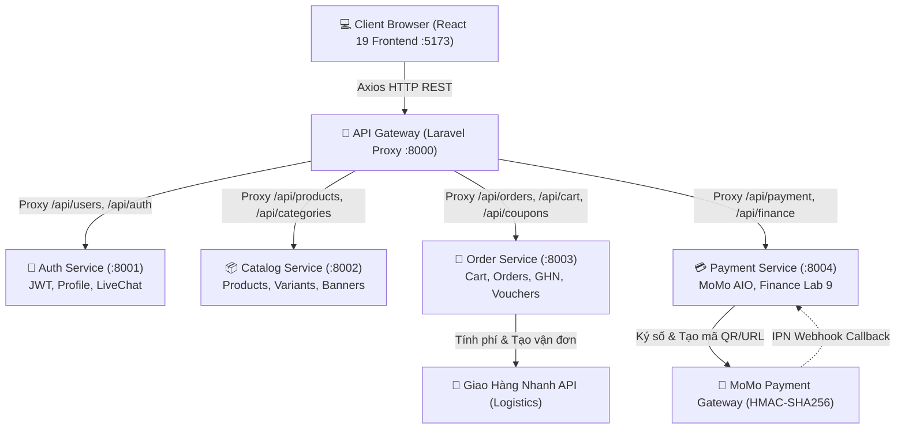
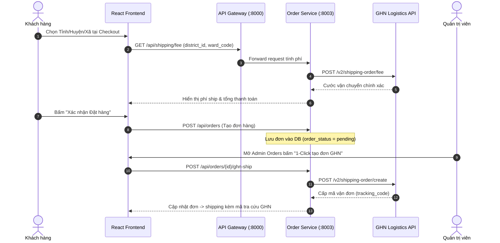
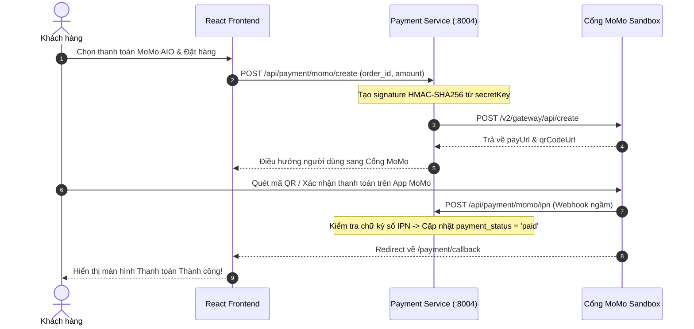
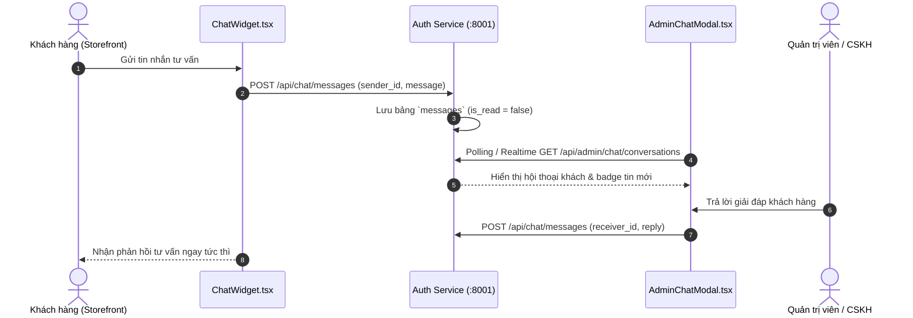

⚽ ĐỀ TÀI: Thiết kế và phát triển hệ thống thương mại điện tử kinh doanh đồ thể thao bóng đá theo kiến trúc hướng dịch vụ
> **Môn học:** Phát triển Phần mềm Hướng Dịch vụ / Kiến trúc Microservices  
> **Nhóm thực hiện:** Nhóm 8  
> **Quy mô:** 5 Thành viên

---

## 🏗️ 1. SƠ ĐỒ KIẾN TRÚC HỆ THỐNG MICROSERVICES (SYSTEM ARCHITECTURE)

Hệ thống được thiết kế theo mô hình **Decoupled Microservices** phân tán. Toàn bộ giao tiếp giữa Single Page App (Frontend) và các dịch vụ nội bộ (Services) đều được quản lý, bảo mật và điều hướng tập trung qua **API Gateway**.

```
                           ┌─────────────────────────────────────────┐
                           │   crs-frontend (React 19 + TypeScript)  │
                           │              Port: 5173                 │
                           └────────────────────┬────────────────────┘
                                                │ REST API (Bearer JWT / Axios)
                                                ▼
                           ┌─────────────────────────────────────────┐
                           │       api-gateway (Laravel Core)        │
                           │              Port: 8000                 │
                           │   (Reverse Proxy, Rate Limit, Auth Guard)│
                           └───────┬─────┬─────────┬─────────┬───────┘
                                   │     │         │         │
          ┌────────────────────────┘     │         │         └────────────────────────┐
          │                              │         │                                  │
          ▼                              ▼         ▼                                  ▼
┌──────────────────┐  ┌────────────────────┐  ┌──────────────────┐  ┌──────────────────┐  ┌──────────────────┐
│   auth-service   │  │  catalog-service   │  │  order-service   │  │ payment-service  │  │  External APIs   │
│    Port: 8001    │  │     Port: 8002     │  │    Port: 8003    │  │    Port: 8004    │  │  GHN / MoMo IPN  │
├──────────────────┤  ├────────────────────┤  ├──────────────────┤  ├──────────────────┤  ├──────────────────┤
│ • Users & Admin  │  │ • Categories       │  │ • Orders & Items │  │ • MoMo Payment   │  │ • GHN Shipping   │
│ • User Addresses │  │ • Brands           │  │ • Cart & Items   │  │ • Transactions   │  │   Fee & Tracking │
│ • Live Messages  │  │ • Products & Tags  │  │ • Coupons/Voucher│  │ • Payment Logs   │  │ • MoMo Sandbox   │
│ • JWT / Password │  │ • Variants/Banners │  │ • Product Reviews│  │ • IPN Webhooks   │  │   AIO QR & ATM    │
│ • DB: auth_db    │  │ • DB: catalog_db   │  │ • DB: order_db   │  │ • DB: payment_db │  │                  │
└──────────────────┘  └────────────────────┘  └──────────────────┘  └──────────────────┘  └──────────────────┘
```



---

## 🔄 2. SƠ ĐỒ QUY TRÌNH & LUỒNG DỮ LIỆU CÁC CHUYÊN ĐỀ NÂNG CAO

### 2.1. Quy trình Đặt hàng & Tạo Vận đơn Giao Hàng Nhanh (GHN Logistics)


---

### 2.2. Quy trình Thanh toán MoMo Sandbox (HMAC-SHA256 & Webhook IPN)


---

### 2.3. State Machine Quản lý Giao dịch & Tài chính Finance 
```
   ┌─────────────┐
   │   pending   ├──────────────┐
   └──────┬──────┘              │ (Giao dịch thất bại)
          │ (Thu tiền/MoMo)     ▼
          ▼              ┌─────────────┐
   ┌─────────────┐       │   failed    │
   │    paid     │       └─────────────┘
   └──────┬──────┘
          │ (Yêu cầu trả hàng)
          ▼
   ┌─────────────────┐
   │ refund_pending  │
   └──────┬──────────┘
          │ (Admin duyệt hoàn tiền)
          ▼
   ┌─────────────────┐
   │    refunded     │
   └─────────────────┘
```
> **Nguyên tắc Tài chính cốt lõi (Finance Rule):** Doanh thu thực tế (`totalRevenue`) và Chi tiêu của khách hàng (`totalSpent`) chỉ được ghi nhận từ các đơn hàng có trạng thái `order_status IN ('delivered', 'paid')` hoặc `payment_status = 'paid'`. Không tính khống các đơn đang chờ xử lý (`pending`), đang giao (`shipping`) hoặc đã hủy (`cancelled`).

---

### 2.4. Luồng Tin nhắn Tư vấn trực tuyến LiveChat 


---

## 🗄️ 3. ĐẶC TẢ CƠ SỞ DỮ LIỆU CÁC DỊCH VỤ

```
┌──────────────────────────────────────┐       ┌──────────────────────────────────────┐
│        striker_auth_db (:8001)       │       │       striker_catalog_db (:8002)     │
├──────────────────────────────────────┤       ├──────────────────────────────────────┤
│ • users (id, name, email, role...)   │       │ • categories (id, name, slug, icon)  │
│ • addresses (province, district, ward│       │ • brands (id, name, slug, logo)      │
│ • messages (sender_id, message, read)│       │ • products (id, sku, price, tags...) │
└──────────────────────────────────────┘       │ • product_variants (color, size, sku)│
                                               │ • banners (id, title, image, link)   │
                                               └──────────────────────────────────────┘
┌──────────────────────────────────────┐       ┌──────────────────────────────────────┐
│        striker_order_db (:8003)      │       │       striker_payment_db (:8004)     │
├──────────────────────────────────────┤       ├──────────────────────────────────────┤
│ • orders (id, code, totals, status)  │       │ • payments (id, order_id, amount...) │
│ • order_items (product, price, qty)  │       │ • payment_transactions (Lab 9)       │
│ • carts & cart_items                 │       │ • payment_logs (raw_payload, status) │
│ • coupons & coupon_usages            │       └──────────────────────────────────────┘
│ • reviews (rating, comment)          │
└──────────────────────────────────────┘
```

---

## 👥 4. BẢNG PHÂN CHIA NHIỆM VỤ CHI TIẾT (5 THÀNH VIÊN - 20%/NGƯỜI)

| STT | Thành viên | Backend Service | Frontend Pages & Components (`crs-frontend`) | 
| :---: | :--- | :--- | :--- | 
| **01** | **Thành viên 1** | **`api-gateway`**<br>(Port 8000) | • Khung giao diện: `ShopLayout`, `Header`, `Footer`, `AdminLayout`<br>• Hạ tầng: `AppContext.tsx`, `api.js` (Axios Interceptors)<br>• Điều hướng: `App.tsx`, `ProtectedRoute`, script `start-all.ps1` |
| **02** | **Thành viên 2** | **`auth-service`**<br>(Port 8001) | • Đăng nhập (`LoginPage`), Đăng ký (`RegisterPage`), Quên mật khẩu<br>• Hồ sơ cá nhân (`Profile.tsx`), Sổ địa chỉ GHN (`AddressBookModal.tsx`)<br>• Quản lý khách hàng (`Customers.tsx`), Chat trực tuyến (`ChatWidget`, `AdminChatModal`) | 
| **03** | **Thành viên 3** | **`catalog-service`**<br>(Port 8002) | • Trang chủ (`Home.tsx`, `HeroBanner.tsx`), Cửa hàng lọc sản phẩm (`Shop.tsx`)<br>• Chi tiết sản phẩm (`ProductDetail.tsx`), Thẻ sản phẩm (`ProductCard.tsx`)<br>• Quản lý sản phẩm & biến thể (`AdminProducts.tsx`), Quản lý Banner (`AdminSettings.tsx`) | 
| **04** | **Thành viên 4** | **`order-service`**<br>(Port 8003) | • Giỏ hàng (`CartDrawer.tsx`), Trang Đặt hàng (`Checkout.tsx`), Lịch sử đơn (`Orders.tsx`)<br>• Đánh giá sản phẩm (`ReviewModal.tsx`), Quản lý Voucher (`CouponModal.tsx`)<br>• Quản trị Đơn hàng Admin (`AdminOrders.tsx` - nút 1-click tạo đơn GHN), `AdminVouchers.tsx` | 
| **05** | **Thành viên 5** | **`payment-service`**<br>(Port 8004) | • Tích hợp các cổng thanh toán tại `Checkout.tsx` (MoMo QR, VietQR, COD)<br>• Trang kết quả thanh toán (`PaymentCallback.tsx`)<br>• **Lab 9:** Quản trị Báo cáo Tài chính (`Dashboard.tsx` - Biểu đồ Neon Spline, KPI, Top bán chạy) |


---


---

## 🚀 5. HƯỚNG DẪN CÀI ĐẶT & KHỞI CHẠY HỆ THỐNG

### 1. Yêu cầu môi trường:
- PHP >= 8.2 & Composer
- Node.js >= 18.x & npm
- MySQL (XAMPP / Laragon / Docker)

### 2. Cài đặt các gói phụ thuộc & Database:
```bash
# Cài đặt thư viện cho 5 Microservices:
cd api-gateway && composer install && copy .env.example .env && php artisan key:generate
cd ../auth-service && composer install && copy .env.example .env && php artisan key:generate && php artisan migrate --seed
cd ../catalog-service && composer install && copy .env.example .env && php artisan key:generate && php artisan migrate --seed
cd ../order-service && composer install && copy .env.example .env && php artisan key:generate && php artisan migrate --seed
cd ../payment-service && composer install && copy .env.example .env && php artisan key:generate && php artisan migrate --seed

# Cài đặt Frontend:
cd ../crs-frontend && npm install
```

### 3. Khởi chạy toàn bộ hệ thống (1 Lệnh duy nhất):
Mở PowerShell tại thư mục gốc của dự án:
```powershell
./start-all.ps1
```

* 🌐 **Giao diện Khách hàng & Quản trị:** [http://localhost:5173](http://localhost:5173)  
* 🚪 **Cổng API Gateway:** [http://localhost:8000](http://localhost:8000)  

